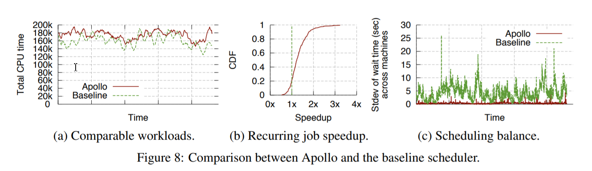
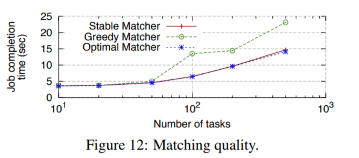

# 集群调度系统笔记
## 目录
- [Apollo](#Apollo(Microsoft))(蔡忠玮)
- [Borg](#Borg)()
- [Sigma](#Sigma)(冯歆骅)
- [Omega](#Omega)(赵樱)
- [Kubernetes](#Kubernetes)(励颖)
## Apollo(Micrisoft)
>Apollo是已经部署在微软的生产环境上的集群调度系统，每天负责上万台机器上数以百万计的高并发计算任务的调度和管理。

### 主要特性
- **Apollo采用分布式和松散协调的调度框架**。传统的中心式调度框架，其可扩展性有很大的限制，为了平衡可扩展性和调度质量，该工作采用了分布式的调度框架，每个调度器根据整个集群的信息独立地进行调度。
- **Apollo将每个任务的完成时间最小化**。Apollo通过估计模型来对每一个提交的作业的任务完成时间进行预估，模型中同时考虑数据的局部性、服务器负载和其他各种因素，并可以根据这些因素进行加权决策，估计模型还可以通过以往类似作业的运行信息来对时间估计进行进一步的细化。
- **每个调度器都拥有整个集群的信息，供其进行调度决策**。Apollo引入了轻量级的硬件独立机制来为调度器提供集群中所有服务器上的资源使用情况，拱调度器使用。
- **Apollo提供了一系列的校正机制**。集群中可能会出现作业运行时间估计不准确、作业冲突、运行时一些不正常的行为等意外状况，Apollo提供的校正机制可以在集群运行时动态的对其进行调整。
- **Apollo引入了机会调度（opportunistic scheduling）**。Apollo将作业分成了两类，常规作业（ regular tasks）和机会作业（ opportunistic tasks），保证常规作业的低延迟的同时使用机会作业来提高集群的利用率，并引入了基于token的机制来管理容量并通过限制常规任务的总数来避免集群的负载过高。
- Apollo的设计是为了替代生产环境中的旧调度器，因此在设计时支持分阶段部署到生产环境中并进行验证。

### 整体框架
 
>上图是Apollo的整体结构图。Job Manager（JM）就是一个调度器，它负责对作业进行调度，每一个集群都会拥有一个Resource Monitor（RM），每一台服务器都拥有一个Process Node（PN），它们两个协调工作来为调度器提供一个全局的视角，供调度器进行调度决策时使用。每个PN负责对本地服务器的资源进行管理，RM会从集群 中每个服务器上的PN那里收集信息，汇总成全局信息后给每个JM。

### 优劣
#### 优点
1. **在调度质量和可扩展性间取得了平衡**
   - 取得了集中式调度设计能获得更优决策的优势同时保证了可扩展性和避免了单一节点故障问题
2. **高聚合调度率**
   - 生产环境中Apollo每个集群可以提供10000-20000/s的调度率
 

3. **稳定的匹配率**
   - Apollo的匹配算法与一个简单的贪婪算法有着相同的渐近复杂度，同时开销可以忽略，但是效果比贪婪算法好得多
     
   
#### 缺点
   - 待补充...

### 个人思考
Apollo作为微软已经部署在生产环境中的集群调度系统，性能是毋庸置疑的，它采用了共享状态的调度器，很好的解决了集中式设计的可扩展性和分布式设计的效率问题。从设计上来讲，调度器自然是获取越多数据来做决策越好，谷歌最初的中心式调度器和双层调度器的设计可能是受限于当时的技术，所有调度器共享状态会产生的问题就是如何低延迟的让调度器获取到最新状态，同时保证所有调度器的同步一致，从架构上看，Apollo的集群resource monitor和服务器的process node比较好的解决了这一问题。

## Borg
---
### 用户视角
- Borg的用户主要是Google的开发者以及SRE，用户将任务以job的方式提交至Borg，每个job中会包含多个task，而各个task会调用同一个程序。每个job占用一个Borg cell，Borg cell中包含多台机器，是Borg的基本单元。
- **Borg的工作分配** Borg将job分为生产级(prod)以及非生产级(non-prod)，prod主要包括延迟敏感的服务，如Gmail这种面向外部用户的服务，或者内部的基础服务如BigTable，non-prod则大多为批处理的工作。每个Borg cell会包含一些prod和一些non-prod，Borg需要同时处理好这些情况。
- **集群与单元** 一个cell（单元）中的机器会被归属于一个集群，这个集群的机器都会放在一个数据中心大楼中，楼内通过网络连接构建一个站点(site),一个集群中往往会有一个大的cell，以及其他的小一些的测试用或者有特殊作用的cell。同一个cell中的机器会有各种各样不同的差异，Borg将这些差异向用户屏蔽。
- **job和task** 一个Borg job包含了名字、所有者以及它包含的task数这些参数，job可以指定一些归约，强制让Borg安排机器时符合这些规约，也可以指定一些属性，作为安排机器时的一些偏好。一个job只会在一个cell中运行。每个task对应为机器上一个容器中运行的多个linux 进程，绝大多数工作不会使用VM，来除去虚拟化的开销，同时也是因为虚拟化的硬件支持在设计Borg的时候成本很高。task的生命周期如下图所示
   
   

>其中submit，kill和update均为用户向Borg发送RPC(Remote Precedure Call)来实现
每个task可以有自己的属性，在全局上task共享属性，但是可以被重载，上图可见，当task的属性被重载时，不一定需要重启task，但有时也需要将task杀掉，等待下次调度。
- **Alloc**是在机器上预留的一些空间，用于调度方便
- **优先级、配额与特权** 每个job都会获得一个优先级，这是一个非负整数，而Borg设定了一些边界，分别是monitoring, production, batch, best effort，他们的优先度依次递减，之前说的prod是指前两种，non-prod为后两种，高优先级的job可以将低优先度的job挤开来保证自己的运行，但是同优先级内的job不能相互停止。Borg会以周为单位向job分配使用计算资源的配额，如果配额不足，那么就不会运行这个job，配额是需要购买的。一些用户是拥有特权的，可以影响调度。
- **命名与监视** 每个job为了让外部访问，需要一个名字，于是就有了Borg命名服务（BNS），类似于DNS。Borg会将task的地址和端口记录在一个Chubby文件中，命名的规则为[task序号].[job名].[所有者].[cell名].borg.google.com。一个叫做Sigma的服务可以提供基于网络的UI，供用户监控自己的job运行情况。

### Borg整体框架

>上图为Borg的总体架构，每个cell中包含一个Borgmaster以及多个Broglet
- **Borgmaster**包含两个*并行*的处理器，一个是主处理器，另一个是调度器。主处理器处理RPC并可能返回可视化的结果，并提供一个UI作为Sigma的备份。Borgmaster在一个cell中有五个备份，同时只有一个是激活的，激活哪个是用Paxos协议进行选择的，当一个挂了，那么会通过Paxos再选一个，上下文切换大约需要一分钟。
- **调度** 当一个job被提交了，Borgmaster会将它记录在Paxos存储中，并将它放在等待队列里。调度器会异步的扫等待队列并进行调度。
- **Borglet** 每个机器上都会装一个Borglet，用于接受Borgmaster的指令并执行，Borgmaster会轮询Borglet来执行任务，如果一个Borglet对好几次轮询都没反应，就会被判定为死了，它的工作会被Borgmaster移交到其他的Borglet上。

### 优缺点 
- **缺点** Job是唯一的用于组织task的机制，每台机器一个IP地址使得事情变得复杂，通过牺牲常规用户来优化特权用户体验
- **优点** Alloc，Cluster的管理不只是Task管理，形象化的问题排查，单一系统中master就是中心

### 评价
- Borg作为一个比较早的大尺寸的运维管理系统，有比较完整的功能以及相当不错的性能，目前几乎所有的Google集群的运算都迁移到Borg上面来了，这本身就可以证明其优越性。同时可以看到，Borg将机器的细节向用户都屏蔽了，来提高用户的开发效率。用户仅通过RPC来控制自己的job也降低了系统的复杂度。由于是Google实际生产使用的系统，其稳定性可靠性应该也是可以保证的。但是由于我并没有做过运维或者大尺度的集群的操作，没有切实的体验。

### Acknowledge
- Abhishek Verma, Luis Pedrosa, Madhukar Korupolu, David Oppenheimer, Eric Tune and John Wilkes from Google Inc. *Large-scale cluster management at Google with Borg*  
- Google Inc. *Borg, Omega, and Kubernetes*. From research.google.com
## Sigma
---

> Sigma是阿里巴巴建设的基于Pouch容器的在线资源调度系统，Sigma集群管理系统是阿里巴巴集团云化战略的关键系统。

 
### 主要特性
- Sigma管理系统既能完成大规模计算需求，又能保证高并发脉冲计算的可靠性。
- 实现混部架构，与基于进程的离线资源调度系统Fuxi (伏羲)深度集成，把两种调度并行处理, 实现基础环境统一。
- 突破了若干CPU、内存和网络资源隔离的关键技术。
- 整体架构有Alikenel、SigmaSlave、 SigmaMaster三层大脑联动合作，设计理念面向终态。

### 优缺点分析
（1）优点
- **三层大脑联动合作** Alikenel、SigmaSlave、SigmaMaster三层大脑联动合作，能很好地处理单物理机日常调度、资源分配、应急处理，批量机器整体调度，决策优化等，系统整体的协调性和最终一致性非常好。
- **优化整体资源利用率** 将延迟不敏感的批量离线计算任务和延迟敏感的在线服务部署到同一批机器上运行，让在线服务用不完的资源充分被离线使用以提高机器的整体资源利用率。
- **应用隔离** 内存、CPU、 网络资源实现有效隔离，保证各应用有足够资源，做到对相关任务的毫秒级自适性调度或限制，以保证高优先级的任务不受影响。
- **策略多样** 实现不同的策略以适应双十-大促与日常场景需求
- **弹性好** 应用能做到自动收缩、垂直伸缩、分时复用。
- **使用开源容器** Pouch容器开源，安全性高，是富容器，可以登录，兼容性好。

（2）缺点
- 容器的调度过程存在一定的碎片化情况。
- 富容器Pouch镜像较大，在大量建站时可能导致宿主机磁盘耗尽或耗时较长情况。

### 未来展望
阿里巴巴作为中国最大电子商务交易平台，体量极大，尤其是双十一大促销时的巨大流量，对阿里的服务器提出了更高的要求。Sigma集群与资源管理系统的建设与使用很好的解决了这一困境，提供了更好的服务的同时也节省了大量的资源。实现了混部架构将延迟不敏感的批量离线计算任务和延迟敏感的在线服务部署这两种需求资源不同的任务在同一机器上以提高了机器的资源利用率，同时也允许了弹性扩缩来处理脉冲情况。其将全阿里所有的计算资源全部集中在一起统筹管理，得以很好得处理日常计算需求与大促时的高脉冲需求。同时，阿里将系统所用的Pouch容器技术开源，给业界和开发者提供差异化，有竞争力的技术选择。系统也兼容了大量其他系统，促进行业共同健康发展。

### 参考资料
1. [想了解阿里巴巴的云化架构 看这篇就够了](http://www.infoq.com/cn/news/2017/12/Cloud-Sigma-Pouch-Alibaba)
## Omega
---

> Google经历了三代资源调度器的架构，分别是中央式调度器架构、双层调度器架构（如Apache Mesos与Hadoop YARN）和共享状态架构, 即Omega。

 

### 1、主要特性
- **Omega采用图1中第三代调度架构：共享状态调度器（Shared-state scheduler）**。每个调度器具有对整个集群的完全访问权，允许它们以**自由通行（free-for-all**）的方式进行竞争，并在更新集群状态时使用乐观并发控制来解决冲突。
- **没有中央资源分配器；所有的资源分配决定都发生在调度器中**。每个调度器都获得一个私用的、本地的、频繁更新的单元状态副本，用于作出调度决策。
- **调度器完全并行运行，不需要等待其他调度器中的工作，并且没有调度器之间的阻塞（head of line blocking）**。
- **Omega采用乐观锁并发控制**。资源申请采用“乐观锁”（即MVCC，Multi-Version Concurrency Control，多版本并发访问控制方式），优先级控制，大大提升并发性。

### 2、Omega相比其它调度方式的优势
（1）其它几种调度方式的缺点：
* 中央调度器无法扩展到大型集群的工作负载。
* 二层调度器可以支持独立的调度器实现，但是由于采用悲观锁，不能很好地处理长决策时间，并且不能调度大量混合负载。

（2）Omega的优点
* 可扩展（10倍数量级）到高批量的混合工作负载，弥补了中央调度器的缺点。
* “乐观锁”的应用大量减少了实际工作中的冲突干扰，并大大提高了性能(调度器完全并行)和高利用率。
* 支持独立的调度器实现，并将整个分配状态暴露给调度器。
* MapReduce的调度证明了Omega的高灵活性，这将为设计专有调度器提供有吸引力的平台。

 
 
### 3、Omega目前的缺点
> 1. Omega的乐观锁方法将比悲观锁方案做更多的工作，因为工作可能需要重新完成。在某些时候，因为高冲突率和重试导致的重复工作，乐观并发控制会崩溃。
> 2. 尚缺乏实用的全局策略，存在公平性、抢占等问题。在Omega的设计下，可以以最快的速度吞噬想要的资源，甚至抢占其他用户的资源，因此需要设计专有的调度器，针对现实中不同类型的作业。
> 3. Omega仍是一个比较新的系统，而类似Mesos，YARN系统已经在开发中，需要继续探索全球性保障（公平性、饥饿避免等）的方法，开发出更稳定、实用的版本。而且论文中均采用模拟结果做评估，尚未投入Omega的实际生产。

### 4、未来前景
> 1. Omega方法灵活性好，若开发专用的调度器，完善分配公平、避免饥饿的策略，则能发挥更大的优势。
> 2. 在数据库领域中，可以寻求新的技术来进一步减少长决策时间的调度器受到干扰的可能性和影响。

### 参考
1. paper: 《Omega: flexible, scalable schedulers for large compute clusters》
2. [解析Google集群资源管理系统Omega](http://dongxicheng.org/mapreduce-nextgen/google-omega/)

-----
## Kubernetes
---
### 主要特性
- **自动化部署**
根据应用程序的计算资源需求和其它一些限制条件，自动地将运行应用程序的容器调度到集群中指定的Node上，且不会影响应用程序的可用性。
- **系统自愈**
当Kubernetes集群中某些容器失败时，会重新启动他们。当某些Node挂掉后，Kubernetes会自动重新调度这些Node上的容器到其他可用的Node上。如果某些容器没有满足用户定义的健康检查条件，这些容器会被判定为无法正常工作的，集群会自动杀死掉这些容器。
- **水平扩展**
通过一个命令就可以实现应用程序的水平扩展，实现这个功能的是HPA（Horizontal Pod Autoscaler）对象。HPA是通过Kubernetes API Resource和Controller的方式实现的，其中Resource决定了Controller的行为，而Controller周期性地调整Replication Controller或Deployment中的副本数，使得观察到的平均CPU使用情况与用户定义的能够匹配。
- **服务发现和负载均衡**
Kubernetes会给每个容器指派一个IP地址，给一组容器指派一个DNS名称，通过这个就可以实现服务的负载均衡功能。
- **自动更新和回滚**
当应用程序发生变更，Kubernetes可以实现滚动更新，同时监控应用的状态，确保不会在同一时刻杀掉所有的实例，造成应用在一段时间范围内不可用。如果某些时候应用更新出错，Kubernetes能够自动地将应用恢复到原来正确的状态。

### 架构设计
Kubernetes的核心组件是基于资源分配的任务调度。Kubernetes的调度策略源自Borg, 但是为了更好的适应新一代的容器应用，以及各种规模的部署，Kubernetes的调度策略相应做的更加灵活，也更加容易理解和使用，如下图：

其中， Controller Manager主要用于管理计算节点（Node Controller）以及Pod副本（Replication Controller）等，Scheduler根据特定的算法和策略调度Pod到具体的计算节点，Kubelet通过apiserver或者监控本地的配置文件（eg. Kubeadm创建的Kuernetes集群），通过docker daemon创建Pod的container。

### 优缺点分析
**优点**：
- 可快速地部署应用程序而无须面对传统平台所具有的风险、动态地扩展应用程序以及更佳的资源分配；
- 硬件使用率下降。由于容器的轻量特性以及更快速杀掉未使用的实体，对硬件的需求降低了40-50%；
- 面向社区而不是技术规范，这让它的功能更加强大；

**缺点**：
- 容器技术自身存在的缺点对Kubernetes能提供的服务存在影响；
- 默认的规化器依赖于应用程序属主提供的资源分配需求，而无视实时的消耗，将在每个节点上产生资源碎片；
- 容器内允许运行的负载范围不够大；

### 评价
基于资源分配的任务调度是Borg和Kubernetes的核心组件，Kubernetes的调度策略源自Borg, 但是为了更好的适应新一代的容器应用，以及各种规模的部署，Kubernetes的调度策略相应做的更加灵活，也更加容易理解和使用。然而，随着容器的爆发，Kubernetes初始设置与其在生产环境中大规模运行之间存在着巨大的鸿沟。未来几年，在管理这些部署和负载方面，它将面临第三方强有力的竞争如果其社区能正确地扩展该平台，Kubernetes的未来一片文明。