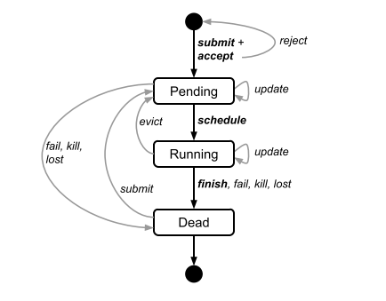
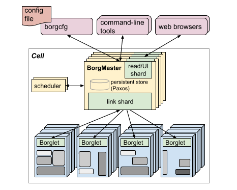
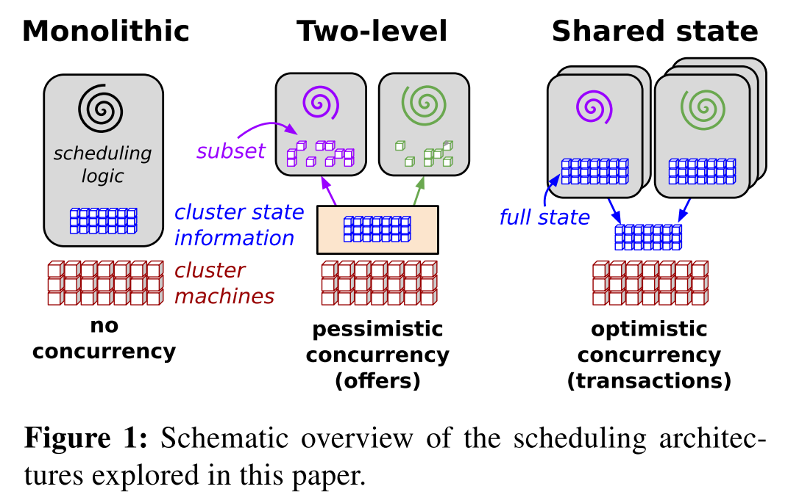
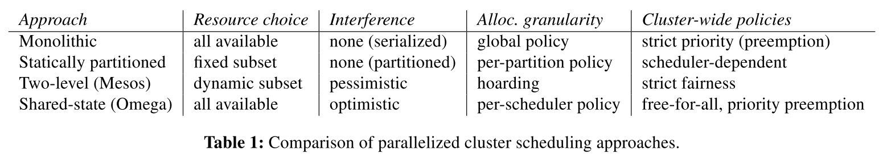

# 集群调度系统笔记

## Apollo(Micrisoft)
---

### 生产环境下的调度
---

### 主要特性
- **Apollo采用分布式和松散协调的调度框架**。传统的中心式调度框架，其可扩展性有很大的限制，为了平衡可扩展性和调度质量，该工作采用了分布式的调度框架，每个调度器根据整个集群的信息独立地进行调度。
- **Apollo将每个任务的完成时间最小化**。Apollo通过估计模型来对每一个提交的作业的任务完成时间进行预估，模型中同时考虑数据的局部性、服务器负载和其他各种因素，并可以根据这些因素进行加权决策，估计模型还可以通过以往类似作业的运行信息来对时间估计进行进一步的细化。
- **每个调度器都拥有整个集群的信息，供其进行调度决策**。Apollo引入了轻量级的硬件独立机制来为调度器提供集群中所有服务器上的资源使用情况，拱调度器使用。
- **Apollo提供了一系列的校正机制**。集群中可能会出现作业运行时间估计不准确、作业冲突、运行时一些不正常的行为等意外状况，Apollo提供的校正机制可以在集群运行时动态的对其进行调整。
- **Apollo引入了机会调度（opportunistic scheduling）**。Apollo将作业分成了两类，常规作业（ regular tasks）和机会作业（ opportunistic tasks），保证常规作业的低延迟的同时使用机会作业来提高集群的利用率，并引入了基于token的机制来管理容量并通过限制常规任务的总数来避免集群的负载过高。
- Apollo的设计是为了替代生产环境中的旧调度器，因此在设计时支持分阶段部署到生产环境中并进行验证。

### Apollo整体框架
---
 
>上图是Apollo的整体结构图。Job Manager（JM）就是一个调度器，它负责对作业进行调度，每一个集群都会拥有一个Resource Monitor（RM），每一台服务器都拥有一个Process Node（PN），它们两个协调工作来为调度器提供一个全局的视角，供调度器进行调度决策时使用。每个PN负责对本地服务器的资源进行管理，RM会从集群 中每个服务器上的PN那里收集信息，汇总成全局信息后给每个JM。

### 工程实践
---
### 性能评估
---

## Borg
---
### 用户视角
- Borg的用户主要是Google的开发者以及SRE，用户将任务以job的方式提交至Borg，每个job中会包含多个task，而各个task会调用同一个程序。每个job占用一个Borg cell，Borg cell中包含多台机器，是Borg的基本单元。
- **Borg的工作分配** Borg将job分为生产级(prod)以及非生产级(non-prod)，prod主要包括延迟敏感的服务，如Gmail这种面向外部用户的服务，或者内部的基础服务如BigTable，non-prod则大多为批处理的工作。每个Borg cell会包含一些prod和一些non-prod，Borg需要同时处理好这些情况。
- **集群与单元** 一个cell（单元）中的机器会被归属于一个集群，这个集群的机器都会放在一个数据中心大楼中，楼内通过网络连接构建一个站点(site),一个集群中往往会有一个大的cell，以及其他的小一些的测试用或者有特殊作用的cell。同一个cell中的机器会有各种各样不同的差异，Borg将这些差异向用户屏蔽。
- **job和task** 一个Borg job包含了名字、所有者以及它包含的task数这些参数，job可以指定一些归约，强制让Borg安排机器时符合这些规约，也可以指定一些属性，作为安排机器时的一些偏好。一个job只会在一个cell中运行。每个task对应为机器上一个容器中运行的多个linux 进程，绝大多数工作不会使用VM，来除去虚拟化的开销，同时也是因为虚拟化的硬件支持在设计Borg的时候成本很高。task的生命周期如下图所示

>其中submit，kill和update均为用户向Borg发送RPC(Remote Precedure Call)来实现
每个task可以有自己的属性，在全局上task共享属性，但是可以被重载，上图可见，当task的属性被重载时，不一定需要重启task，但有时也需要将task杀掉，等待下次调度。
- **Alloc**是在机器上预留的一些空间，用于调度方便
- **优先级、配额与特权** 每个job都会获得一个优先级，这是一个非负整数，而Borg设定了一些边界，分别是monitoring, production, batch, best effort，他们的优先度依次递减，之前说的prod是指前两种，non-prod为后两种，高优先级的job可以将低优先度的job挤开来保证自己的运行，但是同优先级内的job不能相互停止。Borg会以周为单位向job分配使用计算资源的配额，如果配额不足，那么就不会运行这个job，配额是需要购买的。一些用户是拥有特权的，可以影响调度。
- **命名与监视** 每个job为了让外部访问，需要一个名字，于是就有了Borg命名服务（BNS），类似于DNS。Borg会将task的地址和端口记录在一个Chubby文件中，命名的规则为[task序号].[job名].[所有者].[cell名].borg.google.com。一个叫做Sigma的服务可以提供基于网络的UI，供用户监控自己的job运行情况。

### Borg整体框架

>上图为Borg的总体架构，每个cell中包含一个Borgmaster以及多个Broglet
- **Borgmaster**包含两个*并行*的处理器，一个是主处理器，另一个是调度器。主处理器处理RPC并可能返回可视化的结果，并提供一个UI作为Sigma的备份。Borgmaster在一个cell中有五个备份，同时只有一个是激活的，激活哪个是用Paxos协议进行选择的，当一个挂了，那么会通过Paxos再选一个，上下文切换大约需要一分钟。
- **调度** 当一个job被提交了，Borgmaster会将它记录在Paxos存储中，并将它放在等待队列里。调度器会异步的扫等待队列并进行调度。
- **Borglet** 每个机器上都会装一个Borglet，用于接受Borgmaster的指令并执行，Borgmaster会轮询Borglet来执行任务，如果一个Borglet对好几次轮询都没反应，就会被判定为死了，它的工作会被Borgmaster移交到其他的Borglet上。

### 优缺点 
- **缺点** Job是唯一的用于组织task的机制，每台机器一个IP地址使得事情变得复杂，通过牺牲常规用户来优化特权用户体验
- **优点** Alloc，Cluster的管理不只是Task管理，形象化的问题排查，单一系统中master就是中心

### 评价
- Borg作为一个比较早的大尺寸的运维管理系统，有比较完整的功能以及相当不错的性能，目前几乎所有的Google集群的运算都迁移到Borg上面来了，这本身就可以证明其优越性。同时可以看到，Borg将机器的细节向用户都屏蔽了，来提高用户的开发效率。用户仅通过RPC来控制自己的job也降低了系统的复杂度。由于是Google实际生产使用的系统，其稳定性可靠性应该也是可以保证的。但是由于我并没有做过运维或者大尺度的集群的操作，没有切实的体验。

### Acknowledge
- Abhishek Verma, Luis Pedrosa, Madhukar Korupolu, David Oppenheimer, Eric Tune and John Wilkes from Google Inc. *Large-scale cluster management at Google with Borg*  
- Google Inc. *Borg, Omega, and Kubernetes*. From research.google.com
## Sigma
---

## Omega
---

> Google经历了三代资源调度器的架构，分别是中央式调度器架构、双层调度器架构（如Apache Mesos与Hadoop YARN）和共享状态架构,即Omega。

 

### 1、主要特性
- **Omega采用图1中第三代调度架构：共享状态调度器（Shared-state scheduler）**。每个调度器具有对整个集群的完全访问权，允许它们以**自由通行（free-for-all**）的方式进行竞争，并在更新集群状态时使用乐观并发控制来解决冲突。
- **没有中央资源分配器；所有的资源分配决定都发生在调度器中**。每个调度器都获得一个私用的、本地的、频繁更新的单元状态副本，用于作出调度决策。
- **调度器完全并行运行，不需要等待其他调度器中的工作，并且没有调度器之间的阻塞（head of line blocking）**。
- **Omega采用乐观锁并发控制**。资源申请采用“乐观锁”（即MVCC，Multi-Version Concurrency Control，多版本并发访问控制方式），优先级控制，大大提升并发性。

### 2、Omega相比其它调度方式的优势
（1）其它几种调度方式的缺点：
* 中央调度器无法扩展到大型集群的工作负载。
* 二层调度器可以支持独立的调度器实现，但是由于采用悲观锁，不能很好地处理长决策时间，并且不能调度大量混合负载。

（2）Omega的优势
* 可扩展到高批量的混合工作负载。
* “乐观锁”的应用大量减少了实际工作中的冲突干扰。
* 支持独立的调度器实现，并将整个分配状态暴露给调度器。

 
 
### 3、未来可关注并继续努力的方向
> 1. Omega方法灵活性好，若开发专用的调度器，则能发挥更大的优势。
> 2. Omega的乐观锁方法将比悲观锁方案做更多的工作，因为工作可能需要重新完成。
> 3. Omega仍是一个比较新的系统，而类似Mesos，YARN系统已经在开发中，需要继续探索全球性保障（公平性、饥饿避免等）的方法，开发出更稳定、实用的版本。
> 4. 在数据库领域中，寻求新的技术来减少长决策时间的调度器受到干扰的可能性和影响。

### 参考
1. [解析Google集群资源管理系统Omega](http://dongxicheng.org/mapreduce-nextgen/google-omega/)

-----
## Kubernetes
---
