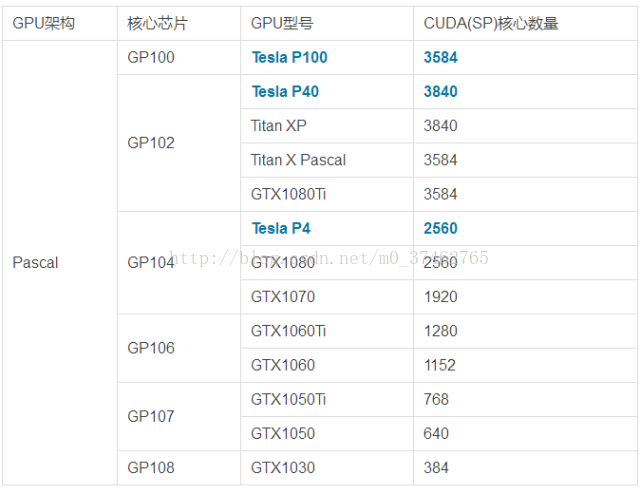

# 计算机硬件

## 目录
- [CPU](#CPU)(蔡忠玮)
- [Memory](#Memory)(冯歆骅)
- [Storage](#Storage)((励颖)
- [Network](#Network)(赵樱)
- [xPU](#xPU)(王韡熙)
## CPU 

### Vendor

- AMD
    > 美国AMD半导体公司专门为计算机、通信和消费电子行业设计和制造各种创新的微处理器（CPU、GPU、APU、主板芯片组、电视卡芯片等)，以及提供闪存和低功率处理器解决方案，公司成立于1969年。AMD致力为技术用户——从企业、政府机构到个人消费者——提供基于标准的、以客户为中心的解决方案。

- Intel
    > 英特尔(intel)是美国一家主要以研制CPU处理器的公司，是全球最大的个人计算机零件和CPU制造商，它成立于1968年，具有50年产品创新和市场领导的历史。

### Key Indicators
- 主频
    > 主频，也就是CPU的时钟频率，简单地说也就是CPU的工作频率，例如我们常说的P4(奔四)1.8GHz，这个1.8GHz(1800MHz)就是CPU的主频。一般说来，一个时钟周期完成的指令数是固定的，所以主频越高，CPU的速度也就越快。主频=外频X倍频。
- 缓存
    > 缓存指的是CPU内部的缓存，一般分为L1，L2，L3三级，一般较为重要的参数为L1缓存的大小，L1缓存越大，CPU访问下级缓存的次数就越少，效率就越高。
- 多线程技术
    > 多线程技术指的是通过架构，使一个核能够并行进行多个线程的计算，现在经常有的多线程技术有SMT以及FMT技术，这可以使CPU执行可以并行的任务时获得性能提高。
- 核数
    > 核数指的是在单一处理器能同时封装的处理器核数，核数越多，在处理多任务以及可以并行的任务时就有优势。
- 是否可超频
    > 参数中的主频指的是厂商测试过的保证能运行正常的频率，但根据CPU的体质不同，有的CPU可以承受更高的主频而不出问题，通过增加CPU的电压可以增加主频，而如果能够超频相当于使用相同的价钱获得了更高的性能。

### Pros & Cons
#### Intel
> 在之前的很长一段时间内，Intel对比AMD在市场份额和产品性能上都有绝对优势，市场份额一度达到了90%，而在最近AMD的Ryzen以及Zen架构问世后，这一优势被逆转，现在AMD市场份额一度达到了50%。Intel相对于AMD的优势在于长时间的高市场份额占据，使得各类其他厂商都针对Intel的处理器有相应的兼容和优化，而AMD新晋的处理器在这方面就差一点。而Intel现在的九代I9仍然是最强的消费级CPU，在相同价位的处理器上主频相对AMD更有优势，在需要主频的单任务上更有优势

#### AMD
> AMD的Ryzen架构在多核上更有优势，在中低端价位的产品上都采用八核十六线程的架构，如果需要多任务的话AMD的CPU更有优势。

### My Comment
Intel的CPU直到不久前都仍然是消费级CPU的首选，但AMD的崛起使得AMD的CPU成为更有性价比的选择，七代i5仅有四核四线程，而八代i5也仅是六核六线程，相比起来AMD类似价位的2700x配置为八核十六线程，就算主频稍微低了一点，从性价比上来说也是完胜的，同时在是否能够超频上，AMD是全面放开限制的，而Intel仅在特定型号的CPU上放开了主频限制从而能够超频，而且IntelCPU每更新一代就不兼容前代的主板，如果想更换就得连主板一起更换，而AMD在这点上更有优势
## Memory

### vendors:
- **金士顿** 金士顿（Kingston）成立于1987年，总部位于美国加州芳泉谷，金士顿在全球拥有超过2400名员工。已经发展成为全球最大的独立内存产品制造商。
- **力晶** 中国台湾内存颗粒生产厂商，其简称为PSC，标志明显。
- **南亚** 南亚是我国台湾生产的内存颗粒，“Nanya”英文是南亚最大的标志，也是最有潜力的一家内存颗粒生产厂商，自家内存条品牌为南亚易胜。
- **三星** 韩国的三星内存颗粒可能当下最多产能的，标识也比较明显分为两种。一种是直接带有samsung标志，另外一种则是sec英文开头。
- **美光** 美光科技有限公司是全球最大的半导体储存及影像产品制造商之一，其主要产品包括DRAM、NAND闪存和CMOS影像传感器。
- **海力士** Hynix 海力士芯片生产商，源于韩国品牌英文缩写"HY"。海力士即原现代内存，2001年更名为海力士。
- **华邦** 是台湾著名的内存芯片生产商，内存芯片标志为Winbond。

### types&pros&cons:
- **SRAM**
 SRAM（Static RAM）意为静态随机存储器。SRAM数据不需要通过不断地刷新来保存，因此速度比DRAM（动态随机存储器）快得多。但是SRAM具有的缺点是：同容量相比DRAM需要非常多的晶体管，发热量也非常大。因此SRAM难以成为大容量的主存储器，通常只用在CPU、GPU中作为缓存，容量也只有几十K至几十M。
- **RDRAM**
RDRAM是由RAMBUS公司推出的内存。RDRAM内存条为16bit，但是相比同期的SDRAM具有更高的运行频率，性能非常强。然而它是一个非开放的技术，内存厂商需要向RAMBUS公司支付授权费。并且RAMBUS内存的另一大问题是不允许空通道的存在，必须成对使用，空闲的插槽必须使用终结器。
- **XDR RAM**
XDR内存是RDRAM的升级版。依旧由RAMBUS公司推出。XDR就是“eXtreme Data Rate”的缩写。XDR依旧存在RDRAM不能大面普及的那些不足之处。
- **Fe-RAM**
铁电存储器是一种在断电时不会丢失内容的非易失存储器，具有高速、高密度、低功耗和抗辐射等优点。由于数据是通过铁元素的磁性进行存储，因此，铁电存储器无需不断刷新数据。其运行速度将会非常乐观。而且它相比SRAM需要更少的晶体管。它被业界认为是SDRAM的最有可能的替代者。
- **MRAM**
磁性存储器。它和Fe-RAM具有相似性，依旧基于磁性物质来记录数据。
- **OUM**
相变存储器。奥弗辛斯基（Stanford Ovshinsky）在1968年发表了第一篇关于非晶体相变的论文，创立了非晶体半导体学。一年以后，他首次描述了基于相变理论的存储器：材料由非晶体状态变成晶体，再变回非晶体的过程中，其非晶体和晶体状态呈现不同的反光特性和电阻特性，因此可以利用非晶态和晶态分别代表“0”和“1”来存储数据。

### key indicators
- **系统时钟循环周期** 表示了SDRAM能运行的最大频率。譬如：一块系统时钟频率为10ns的SDRAM的芯片，他可以运行在100MHz的频率下。绝大多数的SDRAM芯片能达到这个要求。显然，这个数字越小，SDRAM芯片所能运行的频率就越高。对于现代（Hyundai）PC-100 SDRAM，它的芯片上所刻的-10代表了其运行的时钟周期为10ns，他可以跑100MHz的外频。根据现代的产品数据表我们可以知道这种芯片的存取数据的时间（以下会讲到该指标）为6ns。
- **存取时间** 类似于EDO/FPM DRAM，他代表了读取数据所延迟的时间。绝大多数SDRAM芯片的存取时间为6，7，8或10ns。对于高士达（Goldstar）PC-100 SDRAM，它的芯片上所刻的-7代表了其存取时间为7ns。然而他的系统时钟频率仍然为10ns，外频为100MHz。
- **CAS(纵向地址脉冲)反应时间** CAS的延迟时间。某些SDRAM能够运行在CAS Latency(CL)2或3模式。也就是说他们读取数据所延迟的时间既可以是二个时钟周期也可以是三个时钟周期。我们可以把这个性能写入SDRAM的EEPROM中，这样PC的BIOS会检查此项内容，并且以CL=2模式这一较快的速度运行。

### my comment(example of tradeoff)

市场上常见的SDRAM品牌有现代、三星、LG、NEC、东芝、西门子、TI(德州仪器)等等。购买时应从以下几个方面考虑
  内存的品牌
  内存的容量
  内存的代数
  内存的频率
  双通道内存
  内存的超频与时序
  
此外购买时还应注意观察芯片表面印字是否清晰，标称速度为多少以及产地。需要特别说明的是上面所说的品牌仅仅是指内存芯片，而不是整个内存条，将内存芯片封装在电路板上制成内存条的工作是由其他厂商完成的。例如著名的美国金仕顿内存只是封装其他厂商的优质内存芯片制成的，它本身并不生产内存芯片。所以，即使采用同一品牌芯片的内存条，由于封装厂商不一，质量也会存在很大差异。
这时就需要从电路板的工艺上判断。好的电路板，外观看上去颜色均匀、表面光滑、边缘整齐无毛边，采用六层板结构且手感较重。主流的LGS内存已经被HY内存取代，虽然牌子换了，但是东西还是一样的，常见的型号是GM72V66841ET7J，是8×8的颗粒。
## Storage

## Network

## xPU
### GPU
- **Nvidia Tesla**  
Nvidia 为了进行高性能计算而专门生产的GPU，由Nvidia原厂生产，其中的CUDA数量如下
  
Tesla系列GPU因为GPU核心内部的寄存器、L1/L2缓存和显存都支持ECC校验功能，所以Tesla不仅能检测并纠正单比特错误也可以发现并警告双比特错误，这对保证计算结果的准确性来说非常重要  
相对于其他的GPU，Tesla拥有更高的显存带宽以及显存（如P40 346GB/s 24GB）  
Pascal核心的Tesla的统一内存技术允许GPU共享彼此的内存以加载更大的数据集

- **AMD FireStream**
FireStream是ATi研发的一个流处理器系列，在AMD收购ATI后改为 Firepro S 系列，建基于Radeon图形显示芯片，提供高性能计算能力。FireStream产品中的显核不是用来作3D加速用途，而是利用显核内置的强大像素处理器变成一群并行处理器，作为浮点运算协处理器，协助中央处理器计算复杂的浮点运算程序，例如复杂的科学运算。  
第一个产品，FireStream 580，是建基于R580图形芯片。它将是一块采用R580显核的特殊显示卡，R580显示核心中的48个独立的像素处理器能带来强大的浮点运算性能。该产品采用PCI Express x16作为接口，流处理器的频率是600 MHz，可以同时运行512线程，并配备了1GB GDDR3存储器，频率是1300 MHz。并有可能使用多个核心并发处理数据。这个流处理器的功耗为165瓦特。  
2007年十一月末，AMD正式发布第二代FireStream流处理器，AMD FireStream 9170，建基于55 nm制作工艺的ATI RV670显核，提供业界首个双精度浮点运算流处理器，并达到500 GFLOPS单精度浮点运算速度，功耗向下调至不多于150瓦特。并将于2008年第一季推出FireStream SDK，提供Compute Astraction Layer（CAL），成为一个完整的软体编写与开发平台，让开发人员利用高级编程语言（例如：C语言或C++等，以及其他专有函数库，如：Brook+或RapidMind等）编写程序，并经过CTM界面，进行低级（机器代码）微调。  

### TPU(Tensor Processing Unit)
- **Google制造** 是Google为机器学习定制的专用芯片（ASIC），专为Google的深度学习框架TensorFlow而设计。
- **满载功耗低** 采用8bit处理单元，使得单一运算的操作功耗更低而且速度更快
- **缺点**  
    当10%负载时，使用的电量相当于满载时的88%
    且在内存带宽上表现并不好

### IPU(Inteligent Processing Unit)
- **Graphcore制造**  
- **整型浮点型混合计算** 处理器上同时有浮点运算单元与整型运算单元，单卡有两个处理器，处理器为16nm工艺  

### My Comment
    可以看到每种处理器的适用范围是有区别的，比如GPU可以进行通用计算且适用广，TPU在TensorFlow上表现优异，但是对NN硬件的支持并不
    好，IPU则有更高的功耗，挑选适合自己业务的计算单元才能更好的使用这些东西。而更加省心省力的方式还是购买大厂的云服务，来获得更
    加方便而且经济的体验。  

