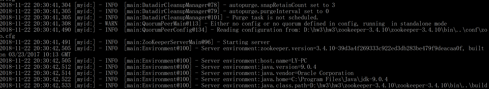
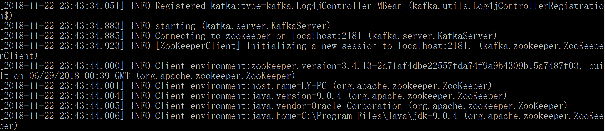

# **Kafka环境搭建**


### **步骤一：下载安装包**
- ##### 下载安装包并解压
    ```
  kafka安装包：http://kafka.apache.org/downloads 

  zookeeper安装包：http://archive.apache.org/dist/zookeeper/
    ```

- #####
    如果还未安装 jdk，需先下载 jdk 和 jre，并且修改环境变量%JAVA_HOME%


### **步骤二： 修改环境变量**
- ##### 环境变量增加两条路径，如下图:
    ```
    D:\hw3\hw3\zookeeper-3.4.10\zookeeper-3.4.10\bin
    D:\hw3\hw3\kafka_2.12-2.0.0\kafka_2.12-2.0.0\bin\windows
    ```


### **步骤三： 修改zookeeper的config文件**
- ##### 将 zoosample.cfg 文件名改为 zoo.cfg
    ```
    参考路径：D:\hw3\hw3\zookeeper-3.4.10\zookeeper-3.4.10\conf\zoosample.cfg
    ```
- ##### 为 zookeeper 创建 data 文件夹
    打开zoo.cfg文件，将第12行dataDir路径修改为当前zookeeper路径，并加上/data后缀，如下：
    ```
    dataDir=D:/hw3/hw3/zookeeper-3.4.10/zookeeper-3.4.10/data
    ```

- ##### 修改用户端口 
    打开zoo.cfg文件，将第14行clientPort改为2181，如下：
    ```
    clientPort=2181
    ```

### **步骤四：修改kafka的config文件**
- ##### 找到server.properties文件
    
    ```
    参考路径：D:\hw3\hw3\kafka_2.12-2.0.0\kafka_2.12-2.0.0\config\server.properties
    ```
- ##### 修改broker ID
    将server.properties中第21行的broker.id设为0
    ```
    broker.id=0
    ```
- ##### 创建用于存放日志文件的文件夹
    将server.properties中第60行的log.dirs的路径修改为kafka config的路径，并加上/kafka-log后缀，如下：
    ```
    log.dirs=D:/hw3/hw3/kafka_2.12-2.0.0/kafka_2.12-2.0.0/config/kafka-logs
    ```
- ##### 修改连接zookeeper的端口
    将server.properties中第123行的zookeeper.connect修改为localhost:2181，如下：
    ```
    zookeeper.connect=localhost:2181
    ```

### **步骤五：运行zookeeper**
- ##### 进到命令行界面
- ##### 进入到zookeeper-3.4.10目录
- ##### 输入zkserver命令，如下：
    
    
- ##### 如果成功运行，将会出现以下界面：
    

### **步骤六：运行kafka**
- ##### 确保zookeeper正在运行
- ##### 打开一个新的命令行窗口
- ##### 进入到kafka_2.12-2.0.0目录下
- ##### 输入命令："./bin/windows/kafka-server-start" "./config/server.properties", 如下：
    
- ##### 如果成功运行，将会出现以下界面：
    
- ##### 错误处理：如果出现以下报错：
    
    ##### 进行以下操作：
    ##### 打开kafka-run-class.bat文件
    ##### 在第179行的%CLASSPATH%前后加上双引号，如下：
    ```
        set COMMAND=%JAVA% %KAFKA_HEAP_OPTS% %KAFKA_JVM_PERFORMANCE_OPTS% %KAFKA_JMX_OPTS% %KAFKA_LOG4J_OPTS% -cp "%CLASSPATH%" %KAFKA_OPTS% %*
    ```


    


