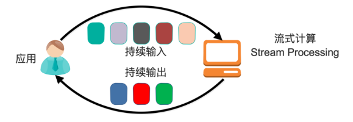

# **Streaming Processing**


## **介绍**
#### 一、 简介
Kafka Stream是Apache Kafka从0.10版本引入的一个新Feature。它是提供了对存储于Kafka内的数据进行流式处理和分析的功能。
#### 二、特点
- Kafka Stream提供了一个非常简单而轻量的Library，它可以非常方便地嵌入任意Java应用中，也可以任意方式打包和部署
- 除了Kafka外，无任何外部依赖
- 充分利用Kafka分区机制实现水平扩展和顺序性保证
- 提供记录级的处理能力，从而实现毫秒级的低延迟
- 支持基于事件时间的窗口操作，并且可处理晚到的数据
- 同时提供底层的处理原语Processor，以及高层抽象的DSL
### 三、架构

在流式计算模型中，输入是持续的，可以认为在时间上是无界的，也就意味着，永远拿不到全量数据去做计算。同时，计算结果是持续输出的，也即计算结果在时间上也是无界的。流式计算对实时性要求较高，同时是先定义目标计算，然后数据到来之后将计算逻辑应用于数据。


## **Demo详细步骤**
###### 以下命令均在windows系统下完成

#### 一、 启动zookeeper和kafka
- 详见Kafka Setup.md文档


#### 二、分别为输入流和输出流创建一个新的topic
- 打开一个cmd窗口，输入以下命令：
> kafka-topics.bat --create --zookeeper localhost:2181 --replication-factor 1 --partitions 1 --topic wordcount-input

> kafka-topics.bat --create --zookeeper localhost:2181 --replication-factor 1 --partitions 1 --topic wordcount-output
- 可以通过以下命令来查看topic是否创建成功
> kafka-topics.bat --list --zookeeper localhost:2181


#### 三、创建一个maven工程，实现流处理的逻辑
- 添加依赖
```
    <dependency>
        <groupId>org.apache.kafka</groupId>
        <artifactId>kafka-streams</artifactId>
        <version>0.10.2.1</version>
    </dependency>
```
- WordCount具体实现
```
public class WordCountExample {

    public static void main(String[] args) {

        Properties props = new Properties();
        props.put(StreamsConfig.APPLICATION_ID_CONFIG, "wordcount");
        props.put(StreamsConfig.BOOTSTRAP_SERVERS_CONFIG, "localhost:9092");
        props.put(StreamsConfig.KEY_SERDE_CLASS_CONFIG, Serdes.String().getClass().getName());
        props.put(StreamsConfig.VALUE_SERDE_CLASS_CONFIG, Serdes.String().getClass().getName());

        final Serde<String> stringSerde = Serdes.String();
        final Serde<Long> longSerde = Serdes.Long();

        KStreamBuilder builder = new KStreamBuilder();   //构造kstream
        KStream<String, String> textLines = builder.stream(stringSerde, stringSerde, "wordcount-input");   //匹配topic
        KTable<String, Long> counts = textLines
                .flatMapValues(value -> Arrays.asList(value.toLowerCase().split("\\W+ ")))   //将句子分割成单词
                .groupBy((key,value) -> value)   //根据单词分组
                .count("");   //统计个数
        counts.toStream().to(stringSerde, longSerde, "wordcount-output"); //构造输出流
        
        KafkaStreams streams = new KafkaStreams(builder, props);

        streams.cleanUp();
        streams.start();
    }
}
```
- 通过mvn package来build, 会在target文件夹中生成kafka-streams-wordcount-1.0-SNAPSHOT.jar包


#### 四、启动生产者
- 打开一个新的cmd窗口并进入到kafka_2.12-2.0.0目录下
- 通过以下命令来启动一个producer，注意topic应是刚刚为输入流创建的topic，和上述代码对应
> kafka-console-producer.bat --broker-list localhost:9092 --topic wordcount-input
- 输入一些单词或句子，也可将输入流写入文件中
> this example counts words


#### 五、运行jar包
- 打开一个新的cmd窗口并进入到maven项目的目录下

- 运行刚刚build的jar包
> java -cp target/kafka-streams-wordcount-1.0-SNAPSHOT.jar com.shapira.examples.streams.wordcount.WordCountExample


#### 六、启动消费者
- 打开一个新的cmd窗口并进入到kafka_2.12-2.0.0目录下
- 通过以下命令来启动一个consumer，注意topic应是刚刚为输出流创建的topic，需和上述代码对应
> kafka-console-consumer.bat --bootstrap-server localhost:9092 --topic wordcount-output --from-beginning --formatter kafka.tools.DefaultMessageFormatter --property print.key=true --property print.value=true --property key.deserializer=org.apache.kafka.common.serialization.StringDeserializer --property value.deserializer=org.apache.kafka.common.serialization.LongDeserializer
- 成功运行，得到以下界面


    