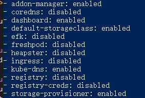
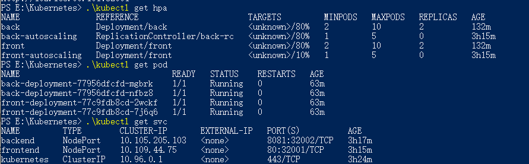

# hw4
- [Part1](#Part1)(赵樱)

---

# Part1: container & image building & CI/CD

Tool: Travis-CI, Docker, nginx(frontend)

Web App: **Godeye(慧眼识踪)**, Summer Group Project

Frontend: https://github.com/zhaoying98sjtu/godeye_frontend

Backend: https://github.com/zhaoying98sjtu/godeye_backend


## 1.1 Frontend
---
1. create **.travis.yml** at the root dir of github： 
2. add node_js version and script: 


After a push/pr, Travis-CI will test the frontend, build an image, and automatically push to the personal DockerHub Registry. 


3. config the **DOCKER_NAME** and **DOCKER_PASSWORD** in the settings of Travis-CI project 

4. add  **Dockerfile** and **nginx.conf** to the root dir, and edit the Dockfile：

 

5. commit and push
```
git push origin master
```

6. see the results on the homepage of Travis-CI
 

7. logo in README.md

<center></center>

## 1.2 Backend
---
Travis-CI supports Docker, so we can build docker image and config CI/CD at the same time. 

1. create **.travis.yml** at the root dir of github 
2. edit it with reference to spring and Travis-CI manual:


**Notice:** When use Maven and Junit，if there is ```mvnw wrapper``` dependency，Travis-CI will run ```./mvnw clean install -B``` and **run mvn package**, this step needs permission, so ```- chmod +x mvnw```  is needed.

3. Travis-CI can automatically build docker images with Dockerfile, so add a **Dockerfile** to the root dir.

Dockfile:


<p>

> ```FROM```：jdk8 basic image env</p>
> ```VOLUME /tmp```：spring boot's default working dir，the tmp file under image will link to it</p>
> ```ADD```：copy .jar and rename it</p>
</p>

4. add Docker Dependencies to ```pom.xml```:
```xml
<plugin>
	<groupId>org.springframework.boot</groupId>
		<artifactId>spring-boot-maven-plugin</artifactId>
	</plugin>
	<!-- add -->
	<plugin>
		<groupId>com.spotify</groupId>
		<artifactId>docker-maven-plugin</artifactId>
		<version>0.4.13</version>
		<configuration>
			<imageName>springio/${project.artifactId}</imageName>
			<dockerDirectory>src/main/docker</dockerDirectory>
			<resources>
			<resource>
			<targetPath>/</targetPath>
			<directory>${project.build.directory}</directory>
				<include>${project.build.finalName}.jar</include>
			</resource>
			</resources>
	</configuration>
</plugin>
```

5. commit and push
```
git push origin master
```
6. see the build log

junit test and build .jar:


docker login & auto-build image & push:


## 1.3 containers
---


## Reference: 
1. https://github.com/travis-ci/docker-sinatra
2. https://spring.io/guides/gs/spring-boot-docker/


# Part 5 AutoScaling

Finally we failed in implementing autoscaling in our system.  
Following is our steps of trying to succeed.  

#### Step 1
First we try to find a tutorial on the internet. Someone says a HorizontalPodAutoscaler node (hpa) should be deploy to autoscale the deployment.  
After apply two hpa node to the cluster, we can see our hpa node through command  

    kubectl get hpa
But the hpa cannot get the load of deployment. I thought it was the hpa wasn't link to the deployment.  

#### Step 2
Run a test to know if my guess is true. Config the minPodNum of hpa to 2, apply. Notice the deployment only have one replica (suspect 2). Should find a way to connect the deployment and hpa.  
While running command  

    kubectl -h
I find there a command 

    kubectl autoscale <deployment>
  

So I use this command to try to implement autoscaling. The deployment auto-scale to 2 replicas. This work.  
But still cannot get the load of deployment.  

#### Step 3
Try to find out why hpa cannot get the load info.  
There's a plugin called 'metric-server' of minikube, but when run  

    minikube addon list
no such plugin was in the list.  I guess because minikube was downloaded from the iso on AliCloud, not the official site. This maybe matter.  
Try to fix the problem, clone the metric-server repo from github and manually deploy it to the cluster. Kubernetis didn't raise any error, but the node cannot be start. Guess it was caused by the Agreation Layer, which should be turn on if third-party plugin was deployed into the cluster. But tutorial are all about Kubernetis, not minikube, cannot find the config file of 'apiserver', which should be modified to turn on the Layer.  
After that, also try to use ReplicaController(rc) to implement AutoScaling, but fail.  
Fail in this step. The final status of the cluster is as follow.  
  


