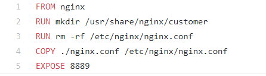
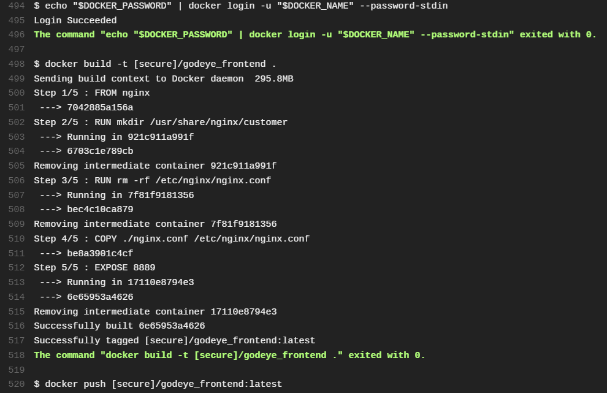
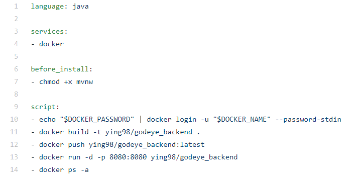
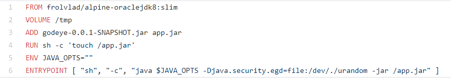
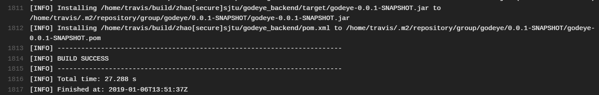
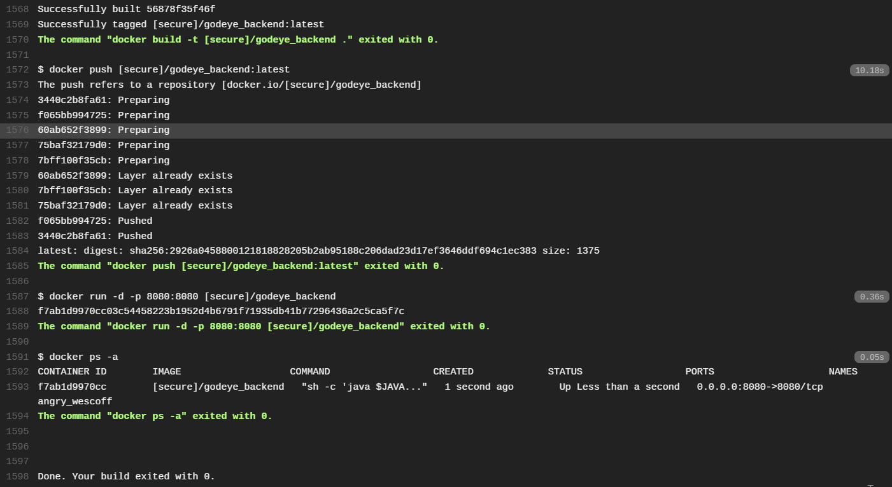
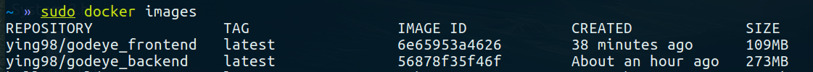
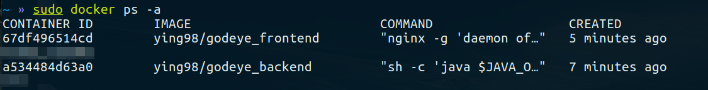

# Part1

**ID: 516030910422**

Tool: Travis-CI, Docker, nginx(frontend)

Web App: **Godeye(慧眼识踪)**, Summer Group Project

Frontend: https://github.com/zhaoying98sjtu/godeye_frontend

Backend: https://github.com/zhaoying98sjtu/godeye_backend

## 1.1 Frontend
---
1. create **.travis.yml** at the root dir of github： 
2. add node_js version and script: 


> After a push/pr, Travis-CI will test the frontend, build an image, and automatically push to the personal DockerHub Registry. 


3. config the **DOCKER_NAME** and **DOCKER_PASSWORD** in the settings of Travis-CI project 

4. add  **Dockerfile** and **nginx.conf** to the root dir, and edit the Dockfile：

 

5. commit and push
```
git push origin master
```

6. see the results on the homepage of Travis-CI

 


## 1.2 Backend
---
> Travis-CI supports Docker, so we can build docker image and config CI/CD at the same time. 

1. create **.travis.yml** at the root dir of github 
2. edit .travis.yml with reference to spring and Travis-CI manual:



Notice: When use Maven and Junit，if there is ```mvnw wrapper``` dependency，Travis-CI will run ```./mvnw clean install -B``` and **run mvn package**, this step needs permission, so ```- chmod +x mvnw```  is needed.

3. Travis-CI can automatically build docker images with Dockerfile, so add a **Dockerfile** to the root dir：

<center>Dockfile of Backend</center>



<p>

> ```FROM```：jdk8 basic image env</p>
> ```VOLUME /tmp```：spring boot's default working dir，the tmp file under image will link to it</p>
> ```ADD```：copy .jar and rename it</p>
</p>

4. add Docker Dependencies to ```pom.xml```:
```xml
<plugin>
	<groupId>org.springframework.boot</groupId>
		<artifactId>spring-boot-maven-plugin</artifactId>
	</plugin>
	<!-- add -->
	<plugin>
		<groupId>com.spotify</groupId>
		<artifactId>docker-maven-plugin</artifactId>
		<version>0.4.13</version>
		<configuration>
			<imageName>springio/${project.artifactId}</imageName>
			<dockerDirectory>src/main/docker</dockerDirectory>
			<resources>
			<resource>
			<targetPath>/</targetPath>
			<directory>${project.build.directory}</directory>
				<include>${project.build.finalName}.jar</include>
			</resource>
			</resources>
	</configuration>
</plugin>
```

5. commit and push
```
git push origin master
```
6. see the build log:

<center>junit test and build .jar </center>



<center>docker login & auto-build image & push</center>




## 1.3 containers
---





## Reference: 
1. https://github.com/travis-ci/docker-sinatra
2. https://spring.io/guides/gs/spring-boot-docker/
