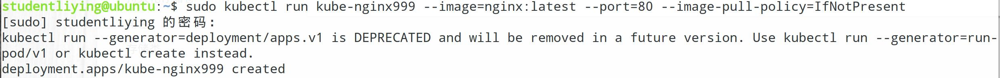
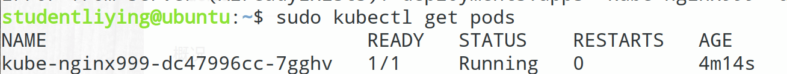
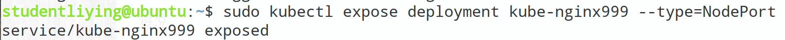
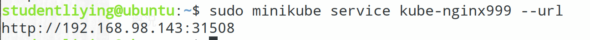
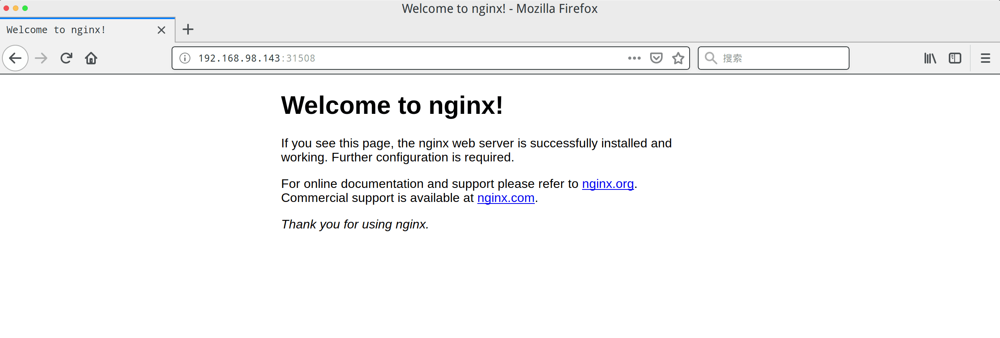
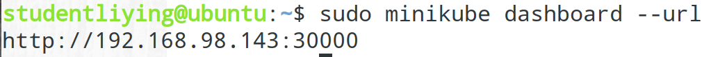
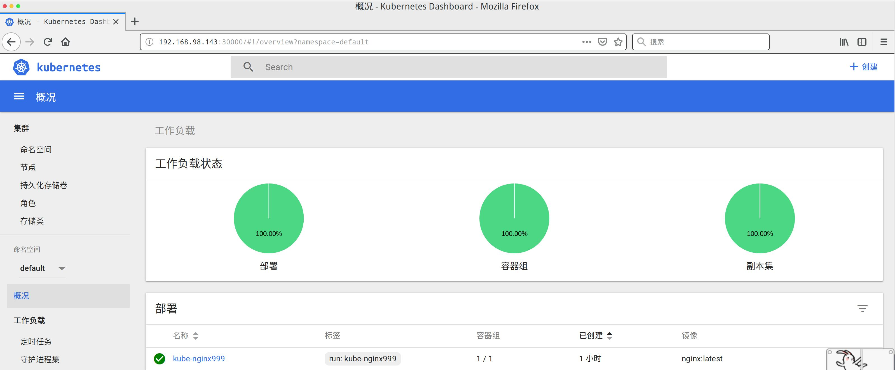
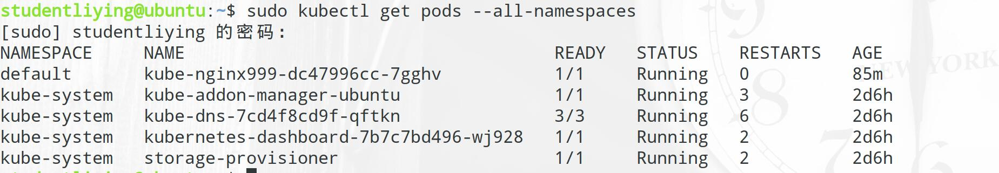

## 搭建K8S集群

### 环境准备

#### 1. 安装docker
```
sudo apt-get install -y docker.io
```
#### 2. 安装Virtual Box5.2(可跳过)
- 添加VirtualBox的源
```
sudo sh -c 'echo "deb http://download.virtualbox.org/virtualbox/debian xenial contrib" >> /etc/apt/sources.list.d/virtualbox.list'
```

- 添加密钥
```
wget -q https://www.virtualbox.org/download/oracle_vbox_2016.asc -O- | sudo apt-key add -
```

- 执行更新
```
sudo apt update
```

- 安装
```
sudo apt install virtualbox-5.2
```

### 安装Kubectl
- Kubectl是Kubernetes命令行工具，可在Kubernetes上部署和管理应用程序，使用kubectl可以检查群集资源；创建、删除、更新组件；查看新集群；并提交示例应用程序。

- 使用snap内核安装

```
sudo snap install kubectl --classic
```

- 验证安装是否成功

```
kubectl version
```

### 安装Minikube
- 使用阿里镜像安装
```
curl -Lo minikube http://kubernetes.oss-cn-hangzhou.aliyuncs.com/minikube/releases/v0.30.0/minikube-linux-amd64 && chmod +x minikube && sudo mv minikube /usr/local/bin/
```

### 启动Minikube
- 如果之前安装了VirtualBox，可通过以下命令
```
minikube start --registry-mirror=https://registry.docker-cn.com
```
- 如果无VirtualBox，则可用以下命令(需先装docker)
```
sudo minikube start --vm-driver=none
```

### 启动容器服务
```
sudo kubectl run kube-nginx999 --image=nginx:latest --port=80 --image-pull-policy=IfNotPresent
```


### 检查状态
```
sudo kubectl get pods
```


### 发布服务
```
sudo kubectl expose deployment kube-nginx999 --type=NodePort
```


### 访问服务地址
- 查询地址
```
sudo minikube service kube-nginx999 --url
```


- 打开浏览器访问


### 启动dashboard
- 查询地址
```
sudo minikube dashboard --url
```

- 打开浏览器，输入地址，可看到管理后台的可视化界面
```
sudo minikube dashboard --url
```


### 通过kubectl进行控制
- 查看所有节点
```
kubectl get pods --all-namespaces
```


